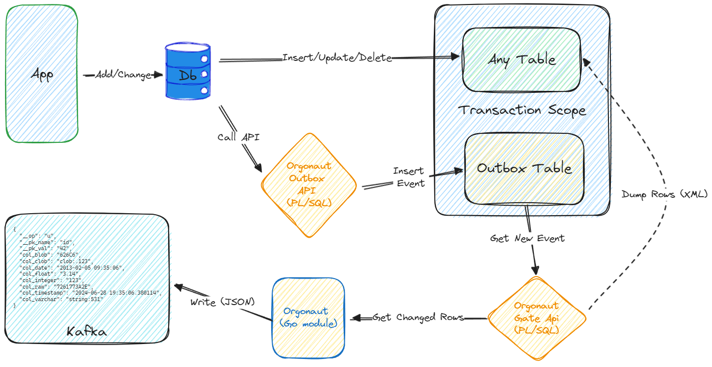

# Orgonaut

Orgonaut is a simple CDC-tool for asynchronous replicating row data changes from Oracle DBMS to Apache Kafka message broker.

## Overview
Orgonaut can be useful for implementing a DIY data replication pipeline.

For example, the data flow can look like:
```
Oracle => Orgonaut => Kafka => Kafka Connect Sink (or Kafka Table Engine) => ClickHouse (etc.)
```

It is applicable when you do not have the opportunity to use CDC solutions such as `Oracle GoldenGate` or `Debezium` 
or does not have access to the DBMS transaction log (with `supplemental logging level`).

* Orgonaut works entirely in "user space" (`SQL`, `PL/SQL` layer) without delving into the details of the DBMS internals. 
* It uses regular tables (and indexes) in the database to build a sequence of change events in a queue.

The name of the app is a wordplay: Oracle + Go.

## Content
- [Features](#Features)
- [Limitations](#Limitations)
- [Architecture](#Architecture)
- [Getting Started](#Getting-Started)
- [Usage Example](#Usage-Example)
- [Implementation Details](#Implementation-Details)


## Features
* Replication is supported for any table (with a single-part numeric primary key).
* Any column data type is supported (except for the limitations of the `dbms_xmlgen` core package).
* The change object can be a set of all the fields in the table or only some of them.
* The change object can also consist of columns of a join of several tables.
* Performance: you can expect processing speeds in the range of 1K-10K rows per second (with an avg row size of ~1KB) or greater (with an optimal number of "shards" and "workers").
* Data is extracted from the database in batches to increase throughput and reduce context switching.
* For efficient transmission over the network (between the database and the transport module), data is also compressed using the gzip algorithm.
* Processing (reading from the database and writing to Kafka) is performed in parallel for each "shard" (based on the primary key hash) of the table.
* Processing supports transactional semantics: the records are marked as processed the processing function completes without errors.
* Compaction of change events for the same key: `the last event wins`.
* The relative order of row changes within a concrete key is kept.
* Delivery guarantees can be understood as `at least once`.
* You can set a topic in Kafka for each table.

## Limitations
* Tables with non-numeric and compound primary keys are not supported at the moment.
* You need to change the logic of your application modifying the rows of the monitored tables (or create DML triggers) -- it is usual for `transactional outbox` pattern.
* You need to grant privileges to the Orgonaut user on select for the monitored tables in other schemas.
* Messages in Kafka are encoded as flat `JSON` format, which is not a fully standardized format (this is similar to the `Debezium` format after applying a flattening transformation).
* Data types such as numbers and dates are represented as formatted strings, the type information is lost.
* Oracle DBMS up to and including version 11 does not have built-in `JSON` support, so `XML` is used.
* The outbox table is not being cleared in any way at the moment.

## Architecture


The design is based on the concept of the `transactional outbox` pattern.
Typical data flow (presented in the picture):
- Your application atomically perform the row modification of the monitored table and, explicitly or implicitly (e.g., using a `after insert/update/delete trigger`), "publishes" the compact data change event (consisting only of the primary key) to the outbox-table by calling the API of the `PL/SQL` package from Orgonaut.
- The transport module (`Go`) periodically polls the outbox table for new events, also using the `PL/SQL` API.
- The change events are enriched with the necessary data of the table row, serialized in `XML` and compressed.
- The received full events are converted from `XML` to `JSON` and sent to the appropriate broker topic.

## Getting Started

### Requirements
- Oracle 11g (lower versions have not been tested).
- Docker (to run local tests) or already deployed Apache Kafka.

### Install DB Objects

1. Create DB Orgonaut user.
2. Login to Oracle as Orgonaut user.
3. Execute [install.sql](scripts/sql/install.sql): 
```shell
sql>@install.sql
``` 

### Configuration

Set up the configuration parameters in [application.yml](configs/application.yml).

* Logging:
```yaml
logging:
  level:
    root: DEBUG
  file:
    name: logs/orgon.log # If empty, then output to Stdout in compact text format
    format: TEXT # Format, JSON or TEXT
```

* Database connection:
```yaml
datasource:
  url: localhost:1521/orcl # DB URL at format host:port/sid 
  schema: orgon
  username: orgon
  password: orgon
  connection_pool:
    max_open_conns: 25
    max_idle_conns: 5
    max_life_time: 60
    max_idle_time: 60
```

* Kafka broker
```yaml
kafka:
  brokers: ["localhost:19092", "localhost:29092", "localhost:39092"] # Address of the Kafka Cluster
  batch_size: 50
  batch_timeout: 10
  required_acks: one # Number of acks from partition replicas required: one, all or none
  compress: true
  topic_auto_create: false
  max_request_size: 4194304
```

* Task Runner
```yaml
runner:
  max_workers: 200 # Max number of simultaneous workers
  repeat_policy:
    backoff_coefficient: 5
    initial_interval: 1000 # Initial poll interval (milliseconds)
    max_interval: 25000  # Max poll interval (milliseconds)
```

* Tasks
```yaml
tasks:
  task_1: # Task description section (one for each type of payload)
    group_id: group_1 # The unique code of the payload group used when publishing in the outbox
    part_count: 42 # Number of parts used when publishing in the outbox
    batch_size: 100 # Maximum rows number in batch
    topic: topic_1 # Kafka topic name
    query: # Parameters for a dynamic SQL-query
      columns: "*" # Listing columns in the selection, e.g.: id, col1, col2 or "*" -- all columns
      from: test_tab # A table, view, or subquery to select data (the name must be specified by the user name if the table is in a different schema)
      pk_column: id # The name of the primary key column, e.g.: id or order_id, etc.
```

### Running
In terminal:
```shell
go run cmd/app/main.go 
```
Or in Docker:
```shell
make docker_build
make docker_run
```

### Shutdown

For the correct termination of the application, the OS "SIGINT" signal must be sent. 
Which corresponds to the user entering an interrupt symbol in the control terminal, by default it is ^C (Control-C).

### Building
``` shell
go build -v -o bin/orgonaut ./cmd/app
```
 Or
```shell
make build
```

## Usage Example

It is assumed that Oracle already is running autonomously.

Ran Kafka and Kafka-UI locally using [docker-compose.yml](docker-compose.yml):
```shell
docker-compose up -d
```

Its creates topics: topic_1, topic_2, topic_3, see in the [UI](http://localhost:8082/ui/clusters/local/all-topics).

Let's create a test table for which we will track changes:
```sql
create table TEST_TAB (
    id NUMBER,
    col_date DATE,
    col_timestamp  TIMESTAMP(6),
    col_integer INTEGER,
    col_float FLOAT,
    col_varchar VARCHAR2(100),
    col_clob CLOB,
    col_raw  RAW(100),
    col_blob CLOB
);

alter table TEST_TAB add constraint TEST_TAB_PK primary key (ID);
```

Let's upload a test dataset (100K):
```sql
insert into test_tab (id, col_date, col_timestamp, col_integer, col_float, col_varchar, col_clob, col_raw, col_blob)
select
    level id,
    sysdate - level/24 dt,
    systimestamp ts,
    dbms_random.random,
    dbms_random.random/7,
    'string:'||dbms_random.value,
    to_clob('clob:' ||dbms_random.value),
    utl_raw.cast_to_raw('raw:' ||dbms_random.value),
    utl_raw.cast_to_raw('blob:' ||dbms_random.value)
from dual
    connect by level < 100001;
```

Let's simulate a call publishing events to an outbox for three types of payload (group_1, group_2, group_3):
```sql
declare
    group_id varchar2(32) := 'group_1';
    bucket_count int := 42;
begin
    for x in (select * from test_tab where rownum < 100001)
    loop
        -- Publishing the update event in the outbox
        org$outbox_api.putUpdateEvent(
            p_key_n        => x.id,
            p_group_id     => group_id,
            p_bucket_count => bucket_count
        );
    end loop;
end;
/
commit
/
-- ... 
```
, see full script: [produce.sql](test%2Fsql%2Fproduce.sql).

Let's set up three tasks to illustrate the selection of all or some columns from tables and from join-query in `application.yaml`:
```yaml
tasks:
  task_1:
    group_id: group_1
    part_count: 42
    batch_size: 100
    topic: topic_1
    query:
      columns: "*"
      from: test_tab
      pk_column: id
  task_2:
    group_id: group_2
    part_count: 42
    batch_size: 100
    topic: topic_2
    query:
      columns: id, rowid, rownum
      from: test_tab
      pk_column: id
  task_3:
    group_id: group_3
    part_count: 42
    batch_size: 100
    topic: topic_3
    query:
      columns: "*"
      from: select t1.*, t2.id as aux_id from test_tab t1, test_tab t2 where t1.id = t2.id
      pk_column: id
```

Let's launch the module:
```shell
go run cmd/app/main.go 
```

, and make sure that the messages are delivered to Kafka using [UI](http://localhost:8082/ui/clusters/local/all-topics). 

Stop and delete the containers:
```shell
docker-compose down -v
```

## Implementation Details

The application consists of two components:
- `PL/SQL` helper hiding implementation details (such as outbox staff, data extraction from a database, serialization and compression).
- `Go` transport module that concurrently consumes data from the database and writes to Kafka (in `JSON` format).

### Handler (Go)

A set of handlers is created for each task in the number of specified partitions count.
Service run each handler in a separate goroutine.
To control the degree of parallelism with a large number of tasks, a semaphore of the size `max_workers` is used.

### Kafka Writer (Go)

Messages in Kafka are represented by a string key based on the primary key of the table (e.d., `id=42`) 
and a value in the form of a flat `JSON` representation of the fields of the database row.
The value also contains additional fields: information about the type of operation, PK, timestamp, etc.

Example of an update message:
```json
{
    "__op": "u",
    "__pk_name": "id",
    "__pk_val": "99360",
    "__ts": "2024-07-02T05:35:27.747697 +00:00",
    "__ux_ts": "1719923727745",
    "col_blob": "626C6F623A2E32333536363133393930343531303636333230323931313537393138343237313137323434",
    "col_clob": "clob:.95882794204588207108639583473998377655",
    "col_date": "2013-02-26 19:59:30",
    "col_float": "-65963638.714285714285714285714285714286",
    "col_integer": "-1444743834",
    "col_raw": "7261773A2E3835323036333137333632303730313732393936323933363535373937333633393539393733",
    "col_timestamp": "2024-06-28 19:59:30.745507",
    "col_varchar": "string:.58753966511070221948574712692564301658",
    "id": "99360"
}
```

Example of a delete message:
```json
{
    "__op": "d",
    "__pk_name": "id",
    "__pk_val": "25524",
    "__ts": "2024-07-02T06:32:20.636000 +00:00",
    "__ux_ts": "1719901940636",
    "id": "25524"
}
```

### Outbox API (PL/SQL)

Insertion into the underlying outbox "queue"-table can become a bottleneck due to the features of monotonous
sequential indexes (based on the b-tree) in highly parallel access conditions.

Therefore, the concept of sharding is used to reduce hotspots (see `org$outbox_api` package):
- Inserts are distributed in buckets.
- Deterministic hash function applied to the passed key is used (the same keys always end up in the same package).

The user must select a unique code (string) for a specific load.
The user must also determine the number of buckets:
- Too high a value is not desirable due to reduced caching efficiency.
- Too small a value may cause synchronization conflicts during recording into DBMS.

The likely optimal value may be in the range of 10-100 (the greater the number of DB server CPU cores and the number of
parallel sessions, the greater the value).

### Consumer API (PL/SQL)

The `org$gate_api` package allows you to access the outbox via the API and receive the next events
for the requested table and a specific part (bucket number).

If the events exist, the data is retrieved from the corresponding table (view or query join).
The data is encoded in XML format using the high-performance Oracle `dbms_xmlgen` core package (written in `C`).
For efficient transmission over the network, data is also compressed using the `gzip` algorithm.